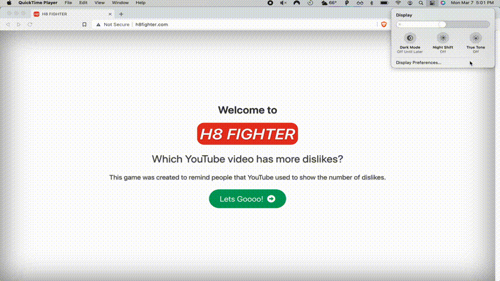

<h1 align = "center">H8 FIGHTER</h1>

<h2 align="center"><a href="http://h8fighter.com">Link to the Project</a></h2>

## Description

**A Simple YouTube Guessing Game**

H8 FIGHTER is a simple guessing game where the user sees two random YouTube videos and guesses which one has the most dislikes. 

### The Story

As you can tell from the starting page, I came up with this idea when news came out that YouTube is now hiding the dislike count in all of its videos. 

The dislike button is the least offensive way to express displeasure towards a video for any reason. Whether the video is outright bad, the video expresses an opinion that you don't agree with or just for the sake of being controversial.

I created this project using technologies that weren't taught in bootcamp, so I had to rely heavily on tutorial videos to make it work. The like-to-dislike ratio is a good indicator of telling whether a video serves its purpose, regardless of its quality. Unfortunately, I have to use a third party to access this feature. 

## How to Play

Compare the two videos and guess which one has the most dislikes.

Click the green target button of that video and the results will show up.

Can you get a high score of 10?

## Technical Features

**This project is containerized using Docker**

If you have Docker installed, you can run this project using `docker-compose up`.

### Client

- The client is created using Vue.js
    - Dynamic components are used to create views that are only navigatable within the website. 
- Bulma is used for the styling
    - An automatic dark-mode feature is implemented that will turn the website dark once dark mode is enabled on the user's system.
- The user's high score will be saved in their browser's local storage.

### Server

- A Flask API whose single purpose is to return a random YouTube video from the MYSQL database in JSON format. 

### Database

- A MYSQL database to hold all of the random YouTube videos and their dislikes.

### Worker

There wasn't really a good way to efficiently get a random YouTube video using the YouTube Data API. Along with that, I wasn't able to get the worker to function before YouTube removed the "dislikeCount" feature from their API, so here's what I did to generate random YouTube videos along with the number of dislikes they have:

#### Beautiful Soup

I used the Beautiful Soup package to extract a random YouTube video ID from <a href="https://www.youtuberandom.com/">Random YouTube Video Generator</a>. I couldn't use this feature too frequently, so I decided to extract video IDs every 10 minutes and save that data into a MYSQL database. To handle the scheduled task, I utilized Celery Beets with Redis. 

#### YouTube Data API

I passed the video ID into the YouTube Data API to get the video title and channel name. 

#### Return YouTube Dislike API

<a href="https://returnyoutubedislike.com/">Return YouTube Dislike</a> is a popular browser extension that brings back the dislike count feauture on YouTube. It does this by using <a href="https://returnyoutubedislike.com/faq">"a combination of archived data from before the offical YouTube dislike API shut down, and extrapolated extension user behavior."</a>

Return YouTube Dislike also has an API that allows me to pass in a video ID and see the dislike count. Because the video IDs are entirely random, some of the videos in my database have little to no dislikes.

I could fix this by only allowing the worker to add popular videos to the database. 

